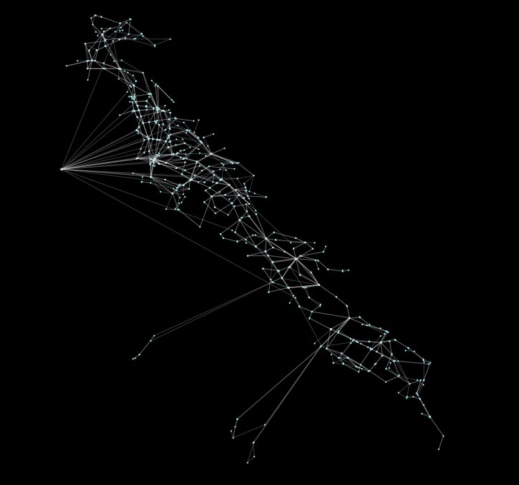

===========
Peartree 🍐🌳
===========

.. image:: https://img.shields.io/travis/kuanb/peartree.svg
        :target: https://travis-ci.org/kuanb/peartree

Peartree is a library for converting `GTFS <https://developers.google.com/transit/gtfs/>`_ feed schedules into a representative directed network graph. The tool uses `Partridge <https://github.com/remix/partridge>`__ to convert the target operator schedule data into `Pandas <https://github.com/pandas-dev/pandas>`__ dataframes and then `NetworkX <https://networkx.github.io/>`_ to hold the manipulated schedule data as a directed multigraph.

Above, an example of multiple Bay Area transit operators being incrementally loaded into Peartree.

Usage
-----

.. code:: python

    import peartree as pt

    path = 'path/to/actransit_gtfs.zip'

    # Automatically identify the busiest day and
    # read that in as a Partidge feed
    feed = pt.get_representative_feed(path)

    # Set a target time period to
    # use to summarize impedance
    start = 7*60*60  # 7:00 AM
    end = 10*60*60  # 10:00 AM
    
    # Converts feed subset into a directed
    # network multigraph
    G = pt.load_feed_as_graph(feed, start, end)

Installation
------------

Note: Still a WIP. Current version on PyPI not good...

.. code:: console

    pip install peartree

